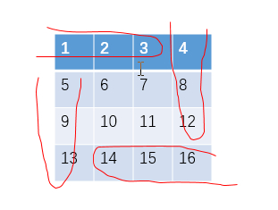

# 面试题29：顺时针打印矩阵

【题目】定义栈的数据结构，请在该类型中实现一个能够得到栈的最小元素的 min 函数在该栈中，调用 min、push 及 pop 的时间复杂度都是 O(1)。


【例如】

```python
输入：matrix = [[1,2,3],
               [4,5,6],
               [7,8,9]]
输出：[1,2,3,6,9,8,7,4,5]
```


```
输入：matrix = [[1,2,3,4],
               [5,6,7,8],
               [9,10,11,12]]
输出：[1,2,3,4,8,12,11,10,9,5,6,7]
```


LeetCode:[顺时针打印矩阵](https://leetcode-cn.com/problems/shun-shi-zhen-da-yin-ju-zhen-lcof/)


**解题思路**

从宏观的层面找共性，**其实转圈打印的过程就是不断顺时针打印外围元素的过程，**只要给你一个左上角的点（如(0,0)）和右下角的点（如(3,3)），你就能够打印出1 2 3 4 8 12 16 15 14 13 9 5；同样，给你(1,1)和(2,2)，你就能打印出6 7 11 10。这个根据两点打印正方形上元素的过程可以抽取出来，整个问题也就迎刃而解了。

打印一个矩阵某个正方形上的点的逻辑如下：





```Python
class Solution:
    def spiralOrder(self, matrix: List[List[int]]) -> List[int]:      
        if matrix == None or len(matrix) < 1: # 若输入为空，则返回空列表
            return []
        array = list()                        # 空数组，用来存放矩阵顺时针打印过程中的数字
        leftRow = 0                           # 打印区域的左上角，右下角端点坐标
        leftCol = 0
        rightRow = len(matrix) - 1
        rightCol = len(matrix[0]) - 1
        while True:
            # 按照四次过程来获取顺时针打印过程的数值
            for index in range(leftCol, rightCol + 1): array.append(matrix[leftRow][index])
            leftRow = leftRow + 1     # 更新左上角端点行坐标
            if leftRow > rightRow: break

            for index in range(leftRow, rightRow + 1): array.append(matrix[index][rightCol])
            rightCol = rightCol - 1  # 更新右下角端点列坐标
            if leftCol > rightCol: break

            for index in range(rightCol, leftCol - 1, -1): array.append(matrix[rightRow][index])
            rightRow = rightRow - 1  # 更新右下角端点行坐标
            if leftRow > rightRow: break

            for index in range(rightRow, leftRow - 1, -1): array.append(matrix[index][leftCol])
            leftCol = leftCol + 1  # 更新左上角端点的列坐标
            if leftCol > rightCol: break
        return array
```


