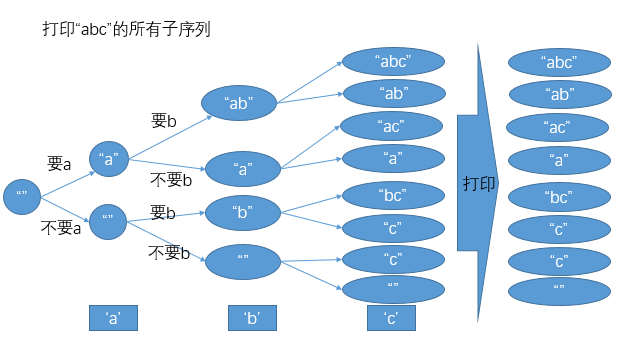

# 面试题38：字符串的排列

【题目】输入一个字符串，打印出该字符串中字符的所有排列。

你可以以任意顺序返回这个字符串数组，但里面不能有重复元素。


**示例:**

```python
输入：s = "abc"
输出：["abc","acb","bac","bca","cab","cba"]
```


LeetCode:[字符串的排列](https://leetcode-cn.com/problems/zi-fu-chuan-de-pai-lie-lcof/)


```Python
#函数功能：从上到下打印二叉树
#基本思路：二叉树的层次遍历
class Solution:
    def levelOrder(self, root: TreeNode) -> List[int]:
        if root == None:
            return []
        data = []       # 队列结构
        nodeArray = []  # 层次遍历输出数组
        data.append(root)
        while len(data) > 0:
            node = data.pop(0)
            if node.left != None:
                data.append(node.left)
            if node.right != None:
                data.append(node.right)
            nodeArray.append(node.val)
        return nodeArray
```


**拓展题目：打印一个字符串的所有子序列**


**补充知识：**

字符串的子序列和子串有着不同的定义。子串指串中相邻的任意个字符组成的串，而子序列可以是串中任意个不同字符组成的串。

**尝试：**

开始时，令子序列为空串，扔给递归方法。首先来到字符串的第一个字符上，这时会有两个决策：将这个字符加到子序列和不加到子序列。这两个决策会产生两个不同的子序列，将这两个子序列作为这一级收集的信息扔给子过程，子过程来到字符串的第二个字符上，对上级传来的子序列又有两个决策，……这样最终能将所有子序列组合穷举出来：



穷举所有可能的子序列。因为每个字符串在子序列中包含两种可能性：出现、不出现。那么算法时间复杂度为：O(2^N)

```Python
#主函数入口
#打印字符串的全部子序列
def AllSubsquences(string):
    if string==None:     #判断输入字符串是否为空字符串
        print("the String is null")
        return None
    else:                #输入字符串不为空时，进入打印字符串全部子序列的函数
        return PrintAllSubsquences(string=string,index=0,res="")


#string:原始字符串
#index：当前递归到字符串哪一位
#res：上一步递归得到的子序列
def PrintAllSubsquences(string,index,res):
    if index>=len(string):  #递归到字符串的最后位
        print(res)
        return
    else:
        PrintAllSubsquences(string,index+1,res)              #index位不加当前字符
        PrintAllSubsquences(string, index+1, res+string[index])#index位添加当前字符
```

